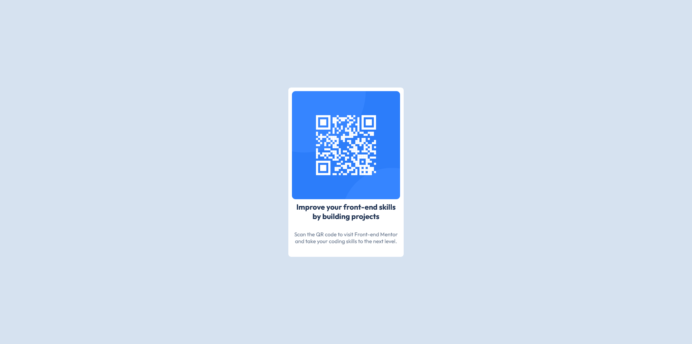

# Frontend Mentor - QR code component solution

This is a solution to the [QR code component challenge on Frontend Mentor](https://www.frontendmentor.io/challenges/qr-code-component-iux_sIO_H). Frontend Mentor challenges help you improve your coding skills by building realistic projects.

## Table of contents

- [Overview](#overview)
  - [Screenshot](#screenshot)
  - [Links](#links)
- [My process](#my-process)
  - [Built with](#built-with)
  - [What I learned](#what-i-learned)
  - [Continued development](#continued-development)
  - [AI Collaboration](#ai-collaboration)
- [Author](#author)

## Overview

### Screenshot



### Links

- Solution URL: [github.com/lmnot343guiltyspark/qr-code-component](https://github.com/lmnot343guiltyspark/qr-code-component)
- Live Site URL: [imnot343guiltyspark.github.io/qr-code-component](https://imnot343guiltyspark.github.io/qr-code-component/)

## My process

### Built with

- Semantic HTML5 markup
- CSS custom properties
- Flexbox
- CSS Grid

### What I learned

I've been knowing the basis to do websites but this first challenge make me feel like I can overcome whatever I think. I learned that I have the skills of do it all by my self and just needed a little push to believe on my self. The most challenging part was the css by far but I learned that with a little bit of patience you can get through all the obstacles. My hardest issue was to make the QR code at the required size.

To see how you can add code snippets, see below:

```html
<link rel="preconnect" href="https://fonts.googleapis.com" />
<link rel="preconnect" href="https://fonts.gstatic.com" crossorigin />
<link
  href="https://fonts.googleapis.com/css2?family=Outfit:wght@100..900&display=swap"
  rel="stylesheet"
/>
```

```css
main {
    display: flex;
    justify-content: center;
    flex-direction: column;
    padding: 10px;
    background-color: hsl(0, 0%, 100%);
    max-width: 320px;
    height: auto;
    border-radius: 8px;
}
```

### Continued development

I would like to focus more in the css area, as former beginner, css was the trickiest part, flexbox gave me a bad time so I think there is a flaw that I need to fix.

### AI Collaboration

I did use Claude, not the coding part just the normal chat and it did well, I put the readme prompts to give Claude some context, and the design and the task challenge and it got me through all the challenge with no sweat, when I got stuck in some parts, it guided me with good questioning so that bring me the ideas to overcome the obstacles.

## Author

- Frontend Mentor - [@Rickgaav](https://www.frontendmentor.io/profile/Rickgaav)
